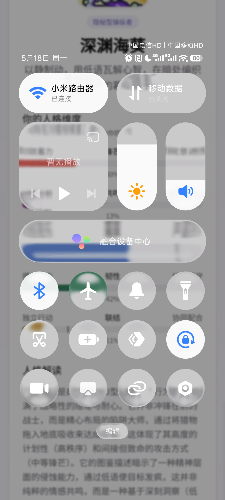
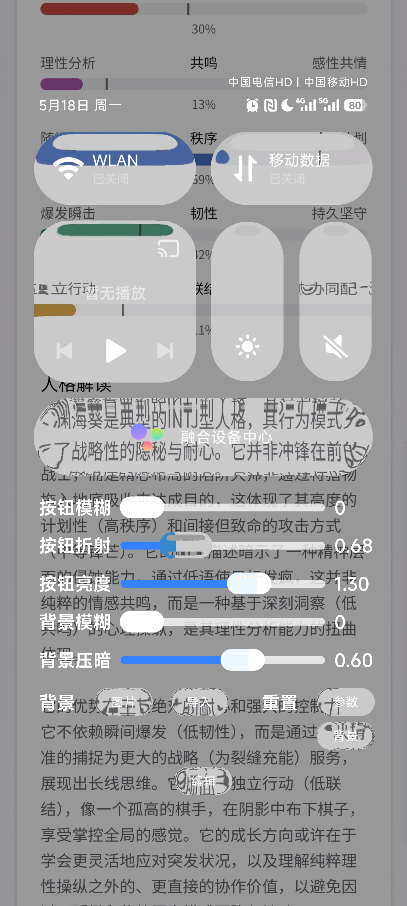
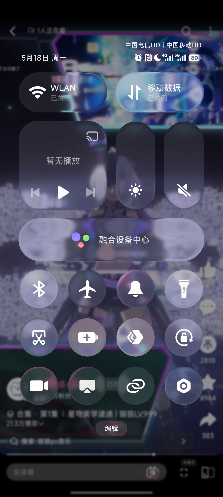

# Xiaomi Glass SystemUI

小米控制中心的液态玻璃材质模拟

参考项目：https://codepen.io/Mikhail-Bespalov/pen/MYwrMNy

Powered by HTML :)

## 使用

Web: https://mrbocchi.github.io/XiaomiGlassSystemUI/

Android APK: [Releases](https://github.com/MrBocchi/XiaomiGlassSystemUI/releases)

## 预览

